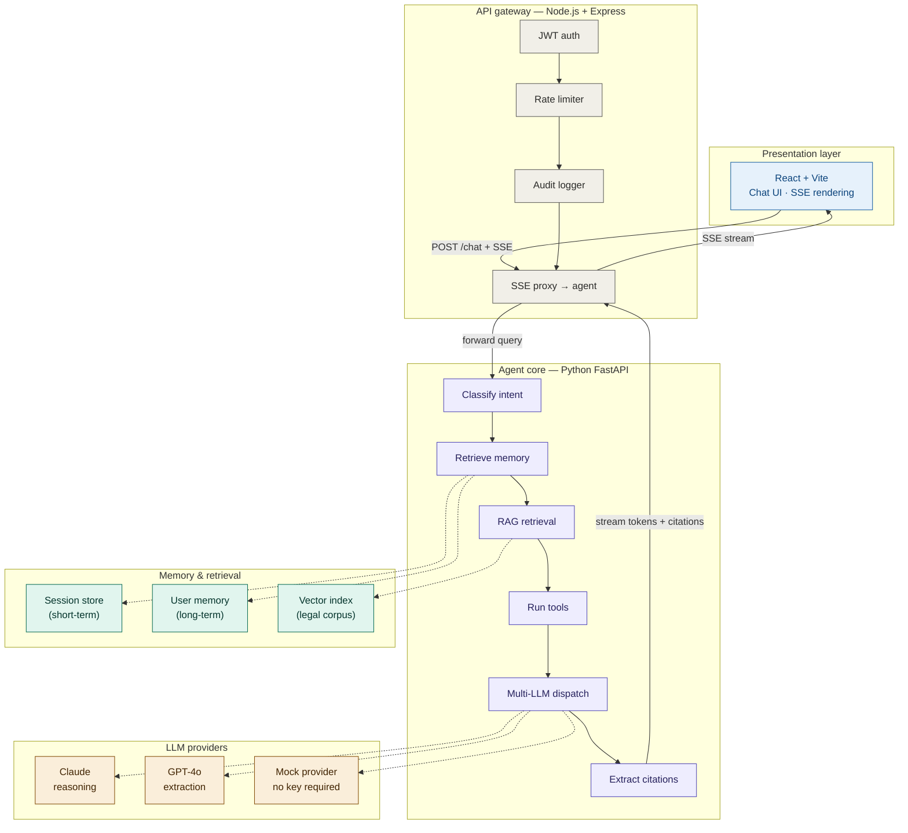
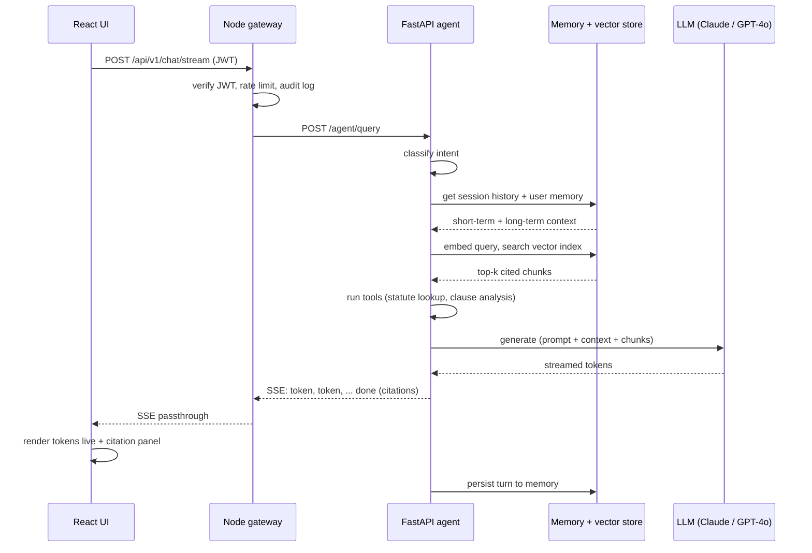

<div align="center">

# Legal / Policy Q&A Agent

**Full-stack, multi-tier AI agent for legal and policy question answering** — React, Node.js, FastAPI, RAG retrieval, persistent memory, and pluggable multi-LLM routing.

[](https://www.python.org/)
[](https://fastapi.tiangolo.com/)
[](https://react.dev/)
[](https://nodejs.org/)
[](#license)

</div>

---

## Architecture



A user's question flows: **React UI → Node.js gateway (auth, rate limiting, SSE proxy) → FastAPI agent (intent classification → memory retrieval → RAG → tools → LLM generation → citation extraction)**, streaming back token-by-token with cited sources.

---

## Request lifecycle



---

## Tech stack

| Layer | Technology |
|---|---|
| Frontend | React 18, Vite, Server-Sent Events |
| Gateway | Node.js, Express, JWT, token-bucket rate limiting |
| Agent | Python, FastAPI, async orchestration pipeline |
| Memory | Session store (short-term) + user memory (long-term) |
| Retrieval | Embedding + cosine-similarity vector search, seeded legal corpus |
| LLMs | Claude (reasoning), GPT-4o (structured extraction), mock fallback |
| Infra | Docker Compose, nginx (optional single-origin deployment) |

---

## Features

- **Streaming chat UI** with live token rendering and a sources panel
- **Multi-LLM routing** by intent, with automatic mock-mode fallback when no API key is set — the whole pipeline is testable with zero cost
- **RAG retrieval** over a seeded legal/policy corpus with inline `[n]` citations
- **Persistent memory** — short-term session history, long-term per-user facts across sessions
- **Domain tools** — statute lookup, contract clause risk analysis, pluggable web search
- **Auth & rate limiting** — JWT auth, per-user token bucket, audit logging
- **Zero-dependency local dev** — only Node + Python needed, no external services required to start
- **Production-shaped** — every local component documents its drop-in production swap (Redis, Postgres + pgvector, Chroma/Qdrant)

---

## Quick start

**Requirements:** Node.js 18+, Python 3.10+

```bash
git clone https://github.com/<your-username>/legal-qa-agent.git
cd legal-qa-agent

cp agent/.env.example agent/.env
cp gateway/.env.example gateway/.env
cp frontend/.env.example frontend/.env
```

Add a key to `agent/.env` for real LLM responses (optional — see [below](#running-without-api-keys)):

```dotenv
ANTHROPIC_API_KEY=sk-ant-...
```

Run all three services:

```bash
# Terminal 1 — agent
cd agent && python3 -m venv venv && source venv/bin/activate
pip install -r requirements.txt
uvicorn app.main:app --reload --port 8000

# Terminal 2 — gateway
cd gateway && npm install && npm run dev

# Terminal 3 — frontend
cd frontend && npm install && npm run dev
```

Open **http://localhost:5173**, sign in with any username/password, and ask:

> "Is a non-compete clause enforceable in California?"

### Docker

```bash
cp .env.example .env   # add API keys at the repo root, optional
docker-compose up --build
```

| Service | URL |
|---|---|
| Frontend | http://localhost:5173 |
| Gateway | http://localhost:4000 |
| Agent (Swagger docs) | http://localhost:8000/docs |

---

## Running without API keys

With no `ANTHROPIC_API_KEY` or `OPENAI_API_KEY` set, the agent runs in **mock mode** automatically — deterministic, realistic responses that still exercise the full pipeline (auth, SSE streaming, RAG retrieval, tool calls, citations, memory). Add a real key and restart the agent to switch to live model output; no code changes needed.

---

## Project structure

```
legal-qa-agent/
├── frontend/                 React + Vite chat UI
│   └── src/
│       ├── components/        ChatInterface, LoginPage, Sidebar
│       ├── hooks/              useChat.js — SSE streaming
│       └── api/                client.js
│
├── gateway/                  Node.js + Express API gateway
│   └── src/
│       ├── middleware/         auth, rateLimit, audit
│       ├── routes/             auth, chat, documents
│       └── app.js
│
├── agent/                    Python FastAPI agent service
│   └── app/
│       ├── graph/              agent.py, nodes.py, state.py — orchestration
│       ├── memory/             session_store, user_memory, vector_store
│       ├── llms/                dispatcher.py — multi-LLM routing
│       ├── tools/               statute_lookup, clause_analyzer, web_search
│       └── main.py
│
├── infra/                    nginx.conf for single-origin deployment
└── docker-compose.yml
```

---

## Swapping in production infrastructure

Every local component exposes the same interface a production version would use — swapping is additive, not a rewrite.

| Local (ships here) | Production swap | File |
|---|---|---|
| In-memory dict | Redis | `agent/app/memory/session_store.py` |
| SQLite | PostgreSQL + pgvector | `agent/app/memory/user_memory.py` |
| JSON vector index | Chroma / Qdrant | `agent/app/memory/vector_store.py` |
| In-memory token bucket | Redis token bucket | `gateway/src/middleware/rateLimit.js` |

---

## Security note

`.env` files are excluded via `.gitignore` — **never commit real API keys**. Check `git status` before pushing if you've added your own keys locally. If a secret is ever committed by accident, revoke it immediately in the provider's console and scrub it from git history before pushing again.

---

## License

MIT — use this however you'd like.

---

## Disclaimer

This project provides general legal and policy information for research and demonstration purposes. It is not a substitute for advice from a licensed attorney.
